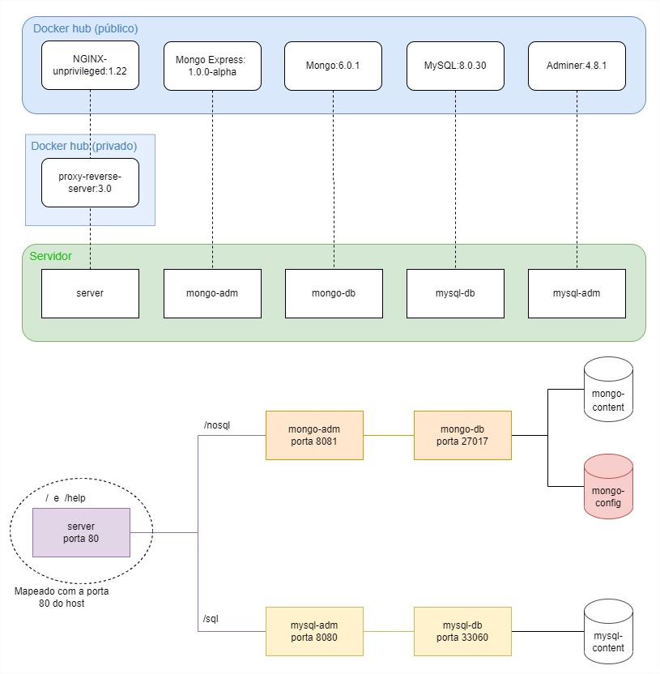

# Implementando sistema com Docker compose

## Sobre o sistema criado
O sistema conta ao todo com 05 containers:
1. **NGINX:** Servidor para proxy reverse do sistema
2. **MongoExpress:** Administrador do banco NoSQL MongoDB
3. **Mongo:** Banco de dados NoSQL
4. **MySQL:** Banco de dados SQL
5. **Adminer:** Administrador do banco SQL MySQL

## Possíveis caminhos
- */sql* acessa o administrador do banco SQL
- */nosql* acessa o administrador do banco NOSQL
- */* acessa a página home
- */help* acessa a página de informações

## Sobre o arquivo .env
Este é o arquivo que contém as variáveis que podem ter seus valores alterados. As variáveis cujos valores estão presentes diretamente no próprio *compose.yml* não devem ter seus valores alterados para que não se comprometa o funcionamento do projeto.

## Funcionamento do projeto
Para acessar o servidor enquanto o mesmo está em execução, basta acessar a porta 80 do localhost utilizando o navegador. Para acessar as demais páginas, utilize as url's parciais descritas no tópico acima junto com a url base do servidor (localhost). Ex: http://localhost/nosql (porta 80 por padrão e por isso não é necessário escrita de localhost:80/nosql).

